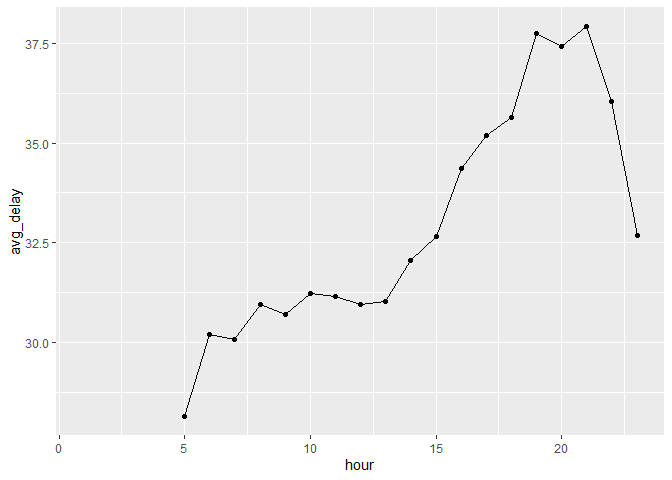
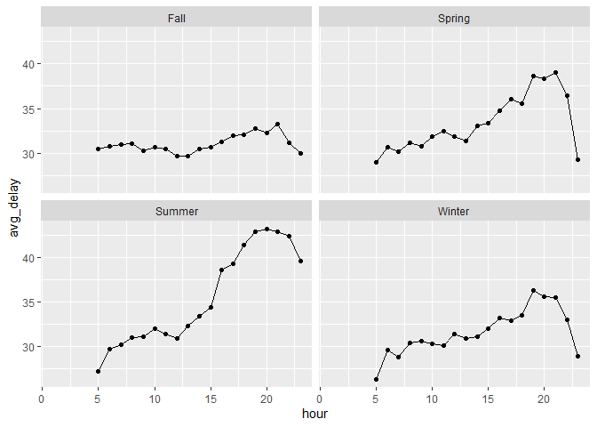
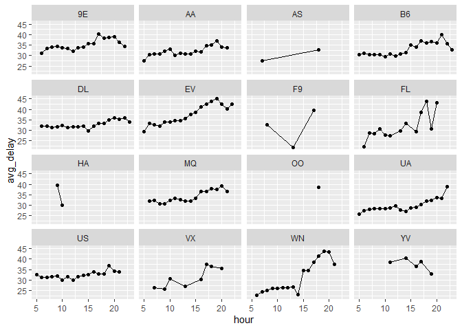
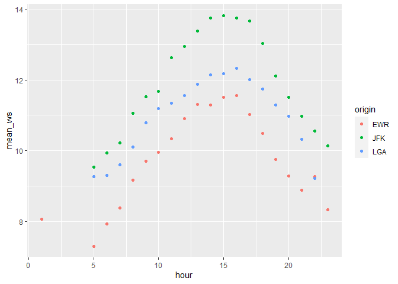
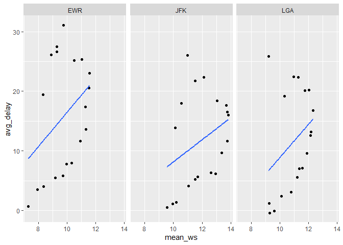
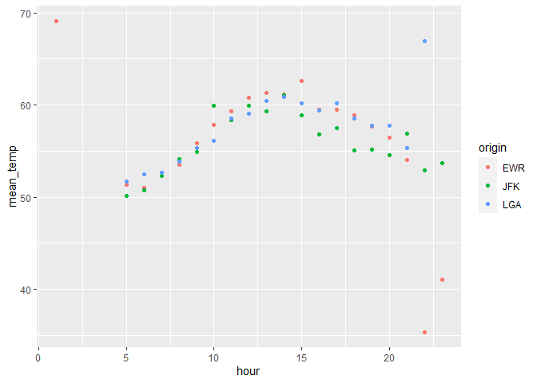
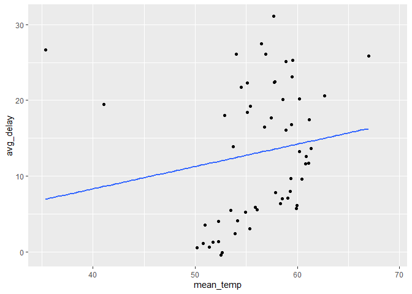

Homework 3
================
Graham Miotke
10/4/2021

Link to github: <https://github.com/gmiotke/433-Homework-3>

Introduction:

The question we were tasked with finding is what time of the day should
you fly if you are looking to minimize delays. There are many different
factors which go into this question. One could look for the proportion
of canceled flights, how long the flights were delayed, or a combination
of the two. I felt like it would be most beneficial to look at the
average delay. Without taking into account any other factors, we can see
that the best time to fly is early in the morning, with very minimal
delays. After the early morning hours, delay times steadily climb until
the evening where they are at a peak. Eventually, delay times do seem to
come down, but only once you get to 10 pm and later.

``` r
flights%>%
  mutate(dep_delay = (dep_delay%/%100) * 60 + (dep_delay%%100))%>%
  group_by(hour)%>%
  summarize(avg_delay = mean(dep_delay, na.rm = T),
            num_flights = n())%>%
  arrange(avg_delay)%>%
  ggplot()+geom_line(aes(hour,avg_delay))+geom_point(aes(hour,avg_delay))
```

    ## `summarise()` ungrouping output (override with `.groups` argument)

    ## Warning: Removed 1 row(s) containing missing values (geom_path).

    ## Warning: Removed 1 rows containing missing values (geom_point).

<!-- -->

After determining this, I decided to check whether delay times were
related to the season. In general, each season followed a similar
pattern to the non-impacted results, with some seasons seeing worse
delay times than others. Next, I wanted to see if the delay times were
in any way related to the airlines in which people decided to fly. These
results were a bit more scattered, but most still seemed to have an
increase as the day went on. These increases seemed to be much more
marginal for some, but it seemed like the morning was still the best
time to fly and the evening was the worst for most airlines. Finally, I
wanted to see if different weather variables impacted the optimal flying
time. Based on the wind speed and temperature variables, it would seem
that the greatest delays actually come a bit earlier in the day, but the
best time to fly remain the early morning hours.

Best time to fly based on season:

``` r
flights%>%
  mutate(dep_delay = (dep_delay%/%100) * 60 + (dep_delay%%100),
         season = case_when(
           month == 12|month == 1|month == 2 ~ "Winter",
           month == 3|month == 4|month == 5 ~ "Spring",
           month == 6|month == 7|month == 8 ~ "Summer",
           month == 9|month == 10|month == 11 ~ "Fall"
         ))%>%
  group_by(season, hour)%>%
  summarize(avg_delay = mean(dep_delay, na.rm = T),
            num_flights = n())%>%
  ggplot()+geom_line(aes(hour,avg_delay))+geom_point(aes(hour,avg_delay))+facet_wrap(~season)
```

    ## `summarise()` regrouping output by 'season' (override with `.groups` argument)

    ## Warning: Removed 1 rows containing missing values (geom_point).

<!-- -->

While the seasons did not drastically change the conclusion that the
morning hours are the best time to fly, there are some staggering
differences between seasons. Fall has a very consistent average delay
time, meaning there seems not to be a bad time to schedule a flight. The
next best would be winter. While the average delay time in winter does
increase, it is not nearly as high as in the spring or summer. The
winter months do have quite low delays in the early hours compared to
the other seasons. Spring has a continuous incline, but a sharp decline
after the 21st hour. The delays in the spring are worse than the fall
and winter for almost all hours of the day. Summer has the greatest
change from the early hours to the later hours. In summer, once you
reach about 3 pm the delays are extremely high, meaning if you want to
avoid long delays, it is necessary to fly in the morning. All in all,
the seasons all follow a similar pattern, the difference between maximum
and minimum delay times, however, does vary greatly between seasons

Best time to fly based on carrier:

``` r
fa = flights%>%
  mutate(dep_delay = (dep_delay%/%100) * 60 + (dep_delay%%100))%>%
  group_by(carrier, hour)%>%
  summarize(avg_delay = mean(dep_delay, na.rm = T),
            num_flights = n())%>%
  arrange(avg_delay)%>%
  filter(num_flights > 10)%>%
  left_join(airlines, by = "carrier")
```

    ## `summarise()` regrouping output by 'carrier' (override with `.groups` argument)

``` r
head(fa)
```

    ## # A tibble: 6 x 5
    ## # Groups:   carrier [3]
    ##   carrier  hour avg_delay num_flights name                       
    ##   <chr>   <dbl>     <dbl>       <int> <chr>                      
    ## 1 F9         13      21.9         153 Frontier Airlines Inc.     
    ## 2 FL          6      22.2         302 AirTran Airways Corporation
    ## 3 WN          6      22.7        1526 Southwest Airlines Co.     
    ## 4 WN         14      23.2          74 Southwest Airlines Co.     
    ## 5 WN          7      24.3        1351 Southwest Airlines Co.     
    ## 6 WN          8      25           180 Southwest Airlines Co.

``` r
tail(fa)
```

    ## # A tibble: 6 x 5
    ## # Groups:   carrier [3]
    ##   carrier  hour avg_delay num_flights name                       
    ##   <chr>   <dbl>     <dbl>       <int> <chr>                      
    ## 1 FL         20      43.3         337 AirTran Airways Corporation
    ## 2 WN         20      43.5         536 Southwest Airlines Co.     
    ## 3 FL         18      43.7         225 AirTran Airways Corporation
    ## 4 WN         19      43.8         392 Southwest Airlines Co.     
    ## 5 EV         18      43.9        1384 ExpressJet Airlines Inc.   
    ## 6 EV         19      45.2        4507 ExpressJet Airlines Inc.

``` r
ggplot(fa)+geom_line(aes(hour,avg_delay))+geom_point(aes(hour,avg_delay))+facet_wrap(~carrier)
```

    ## geom_path: Each group consists of only one observation. Do you need to adjust
    ## the group aesthetic?

<!-- -->

It is a bit harder to analyze whether the best time to fly relates to
the airline which you choose to fly. This is partially because many
airlines have too few flights during a certain time period to make the
data reliable. This leaves some airlines with very few data points, such
as Frontier Airlines (F9). Of the airlines with consistent data points,
there were multiple different trends. Some airlines, such as Delta (DL)
and US have very consistent delays throughout all hours of the day.
There are other airlines which follow the general trend of low delays in
the morning and higher delays in the evening, such as Southwest (WN) and
ExpressJet (EV). So, depending on the airline you choose ot fly with,
you could see consistent delay times, making no one time the best to
fly. You could also potentially see increasing delay times throughout
the day meaning you should fly in the morning.

Best Time to Fly Based on Weather:

``` r
weather2 = weather%>%
  mutate(date = make_date(year,month,day))

fw = flights%>%
  mutate(date = make_date(year,month,day))%>%
  left_join(weather2)%>%
  group_by(hour,origin)%>%
  summarize(avg_delay = mean(dep_delay, na.rm = T),
            mean_temp = mean(temp, na.rm = T),
            mean_ws = mean(wind_speed, na.rm = T),
            num_flights = n())
```

    ## Joining, by = c("year", "month", "day", "origin", "hour", "time_hour", "date")

    ## `summarise()` regrouping output by 'hour' (override with `.groups` argument)

``` r
ggplot(fw, aes(hour,mean_ws, color = origin))+geom_point()
```

<!-- -->

``` r
ggplot(fw, aes(mean_ws,avg_delay))+geom_point()+geom_smooth(se= F, method = "lm")+facet_wrap(~origin)
```

    ## `geom_smooth()` using formula 'y ~ x'

    ## Warning: Removed 1 rows containing non-finite values (stat_smooth).

    ## Warning: Removed 1 rows containing missing values (geom_point).

<!-- -->

``` r
ggplot(fw, aes(hour,mean_temp, color = origin))+geom_point()
```

<!-- -->

``` r
ggplot(fw, aes(mean_temp,avg_delay))+geom_point()+ geom_smooth(se=F, method= "lm")
```

    ## `geom_smooth()` using formula 'y ~ x'

    ## Warning: Removed 1 rows containing non-finite values (stat_smooth).

    ## Warning: Removed 1 rows containing missing values (geom_point).

<!-- -->

The final relationship I attempted to find was the relationship between
best time to fly and weather. I decided to use the variables temperature
and wind speed because it seemed like these factors could impact whether
it was safe for a plane to take off. First I looked at wind speed.
Surprisingly, on average it seemed like the wind speed was slowest in
the early morning hours and late night hours, but fastest in the
afternoon and early evening. After that, it was found that there is a
positive correlation between wind speed and average delay. Therefore, it
would appear based on the wind speed that the best time to fly would be
when the wind speed is lowest, so in the early morning and later night
hours. I also found that the different origins handle the wind speed
differently. While they all seem to handle lower wind speeds with
similar delays, JFK actually seems to handle the highest wind speeds
with the lowest delay of the three origin airports. Next, I wanted to
see if temperature had any impact on the average delay time. I found
that in general the trend in temperature was very similar to that of
wind speed. Surprisingly, there was also a positive correlation between
mean temperature and average delay. This could be due to many factors,
such as number of flights. However, this finding also confirms the idea
that the early morning hours and the later night hours are the optimal
time to schedule a flight. Unlike wind speed, temperature did not seem
to differ much between the different origin airports. In conclusion,
weather would seem to suggest that the best flying time is still the
morning and late night, but the worst time to schedule a flight is
actually a bit earlier than the other analysis suggests.
